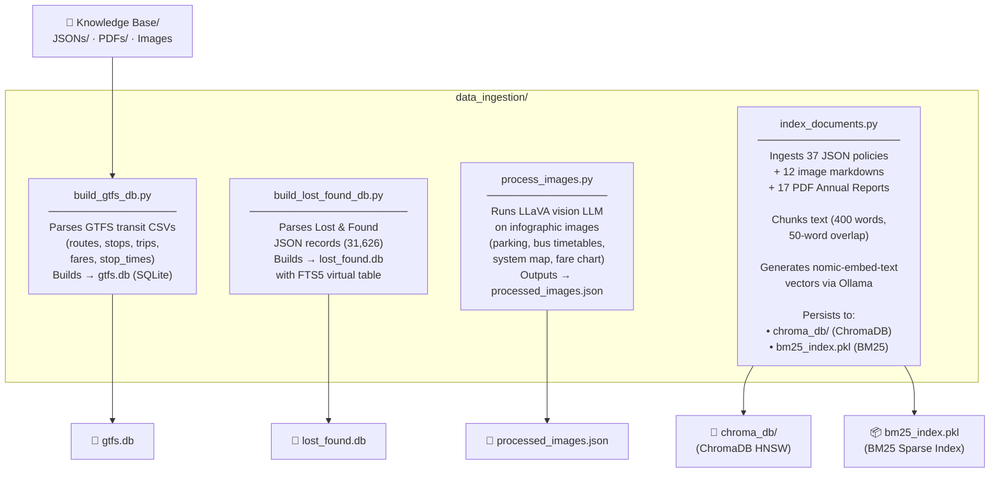
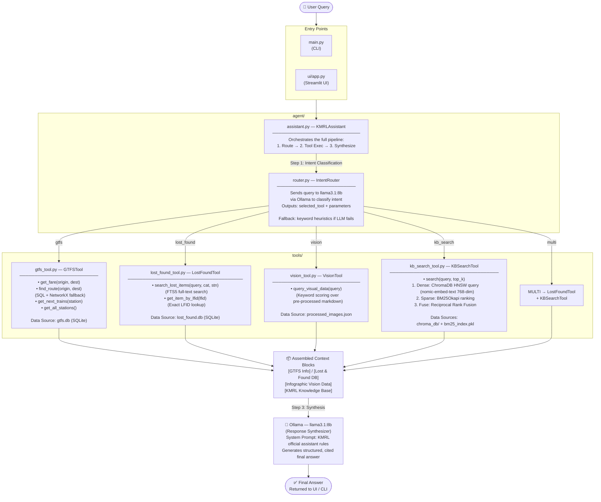

# KMRL Agentic AI Assistant — Codebase Workflow

## System Architecture Overview

The project is a **multi-tool Agentic RAG (Retrieval-Augmented Generation)** assistant for Kochi Metro Rail Limited. It has two distinct phases: **Data Ingestion (offline)** and **Query Processing (runtime)**.

---

## Phase 1 — Offline: Data Ingestion & Index Building

---

## Phase 2 — Runtime: Query Processing Pipeline

---

## File-by-File Responsibility Map

| File | Layer | Responsibility |
|---|---|---|
| [main.py](file:///c:/Users/pooja.ingale/Projects/Kochi%20Metro/KMRL/main.py) | Entry | CLI runner; runs 5 test queries end-to-end |
| [ui/app.py](file:///c:/Users/pooja.ingale/Projects/Kochi%20Metro/KMRL/kmrl_agent/ui/app.py) | Entry | Streamlit web UI with sidebar widgets & chat interface |
| [agent/assistant.py](file:///c:/Users/pooja.ingale/Projects/Kochi%20Metro/KMRL/kmrl_agent/agent/assistant.py) | Agent Core | Orchestrates Route → Tool Exec → LLM Synthesis |
| [agent/router.py](file:///c:/Users/pooja.ingale/Projects/Kochi%20Metro/KMRL/kmrl_agent/agent/router.py) | Agent Core | LLM-based intent classifier → tool selector with fallback heuristics |
| [tools/gtfs_tool.py](file:///c:/Users/pooja.ingale/Projects/Kochi%20Metro/KMRL/kmrl_agent/tools/gtfs_tool.py) | Tool | Deterministic SQL + NetworkX graph queries on `gtfs.db` |
| [tools/lost_found_tool.py](file:///c:/Users/pooja.ingale/Projects/Kochi%20Metro/KMRL/kmrl_agent/tools/lost_found_tool.py) | Tool | FTS5 + SQL queries on `lost_found.db` (31,626 records) |
| [tools/vision_tool.py](file:///c:/Users/pooja.ingale/Projects/Kochi%20Metro/KMRL/kmrl_agent/tools/vision_tool.py) | Tool | Keyword-scored search over `processed_images.json` markdown |
| [tools/kb_search_tool.py](file:///c:/Users/pooja.ingale/Projects/Kochi%20Metro/KMRL/kmrl_agent/tools/kb_search_tool.py) | Tool | Hybrid Dense (ChromaDB) + Sparse (BM25) + RRF Fusion retrieval |
| [data_ingestion/build_gtfs_db.py](file:///c:/Users/pooja.ingale/Projects/Kochi%20Metro/KMRL/kmrl_agent/data_ingestion/build_gtfs_db.py) | Ingestion | Parses GTFS CSV files → SQLite `gtfs.db` |
| [data_ingestion/build_lost_found_db.py](file:///c:/Users/pooja.ingale/Projects/Kochi%20Metro/KMRL/kmrl_agent/data_ingestion/build_lost_found_db.py) | Ingestion | Parses Lost & Found JSON → SQLite `lost_found.db` with FTS5 |
| [data_ingestion/process_images.py](file:///c:/Users/pooja.ingale/Projects/Kochi%20Metro/KMRL/kmrl_agent/data_ingestion/process_images.py) | Ingestion | Uses LLaVA vision LLM to extract text from infographic images |
| [data_ingestion/index_documents.py](file:///c:/Users/pooja.ingale/Projects/Kochi%20Metro/KMRL/kmrl_agent/data_ingestion/index_documents.py) | Ingestion | Chunks + embeds JSON, PDF, Image docs → ChromaDB + BM25 index |

---

## Intent Routing Decision Table

| User Query Type | Selected Tool | Data Source |
|---|---|---|
| Fare / Route / Train timings | `gtfs` → `gtfs_tool.py` | `gtfs.db` |
| Lost or found items / LFID lookup | `lost_found` → `lost_found_tool.py` | `lost_found.db` |
| Parking charges / Feeder bus / System map | `vision` → `vision_tool.py` | `processed_images.json` |
| Annual reports / Policies / Financial data | `kb_search` → `kb_search_tool.py` | `chroma_db/` + `bm25_index.pkl` |
| Lost item + policy grievance combined | `multi` → both `lost_found` + `kb_search` | Both DBs |

